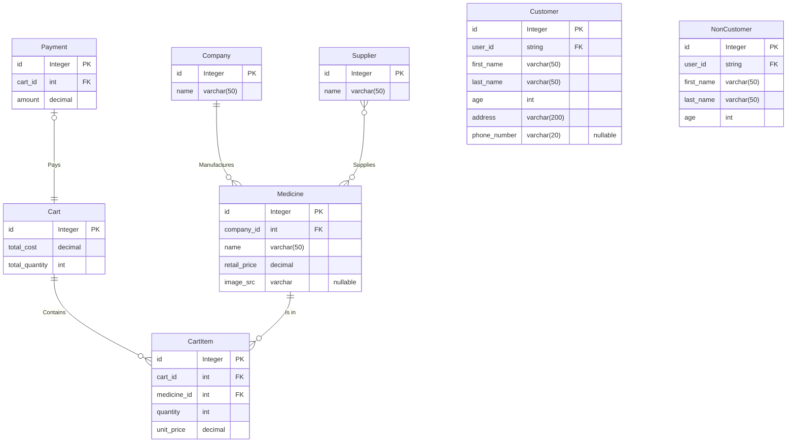

# Project Description

An online pharmacy shop system where users can search for medicines and logged in customers can buy them. The staff can do crud operations on medicines but cannot buy medicines how users buy with carts.

Users must be able to enter the website and look for their specific medicines. Staff members must be able to manage medicines.

# Requirements

1. Razor pages
2. MVC Controller for API
3. Entity Framework Core
4. LINQ
5. Signal R
6. Graphic interface layout

# ER Diagram

