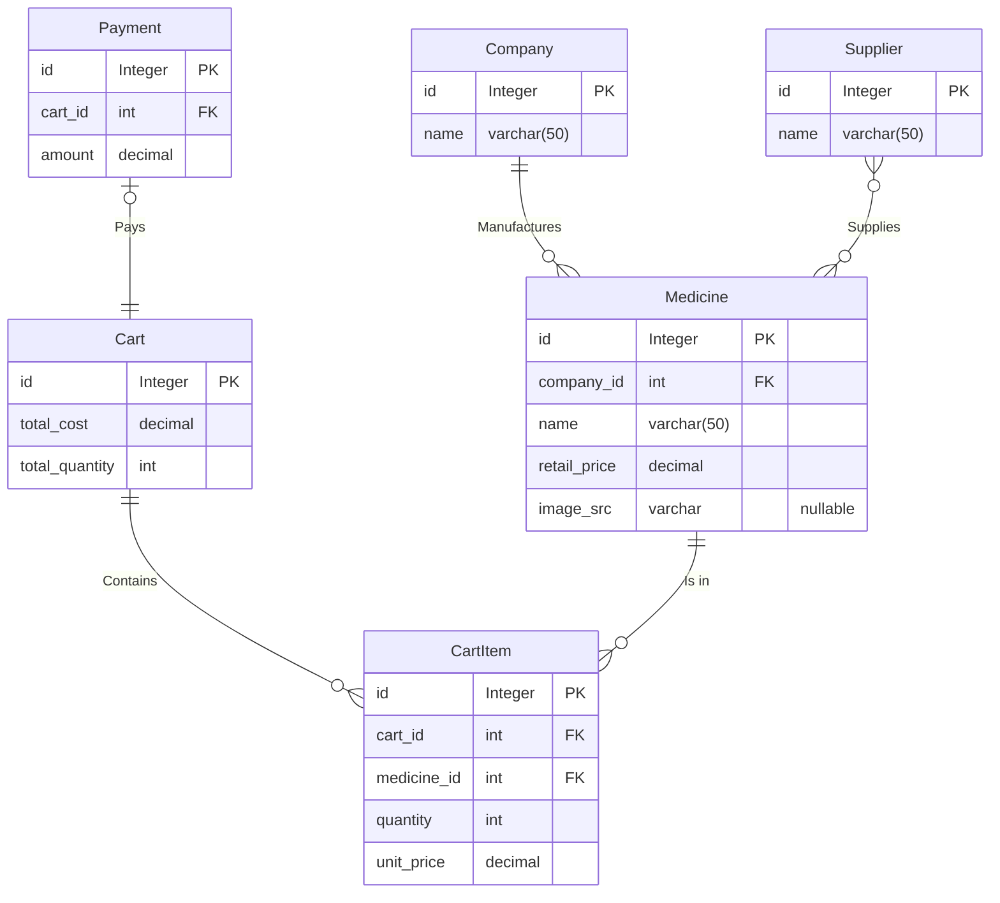

# Project Description

An online pharmacy shop system where users can search for medicines and logged in customers can buy them. The staff can buy medicines, stock them and talk with customer complaints. So there will be three roles for staff members: Stockers, Purchasers, CustomerSupport. The CEO do all this plus having access to every staff info and can hire or fire a staff member.

Users must be able to enter the website and look for their specific medicines. Staff members must be able to mo

# Requirements

1. Razor pages
2. MVC Controller for API
3. Entity Framework Core
4. LINQ
5. Signal R
6. Graphic interface layout

# ER Diagram

